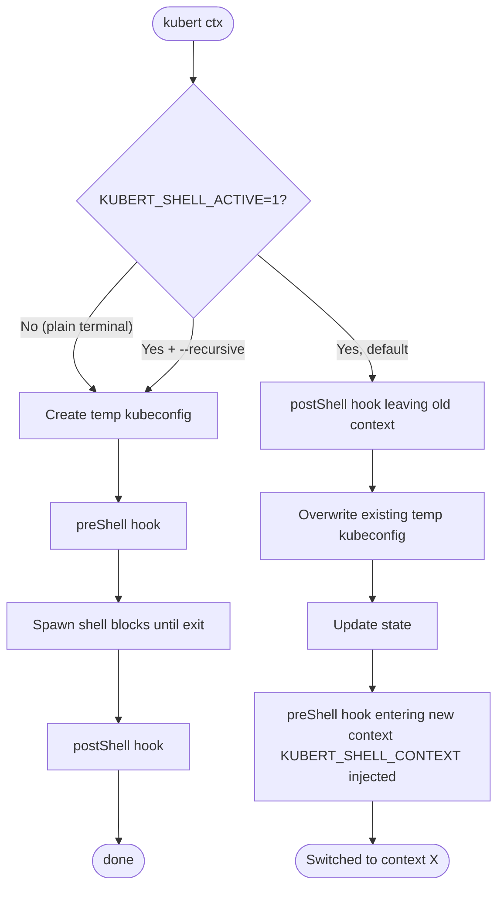
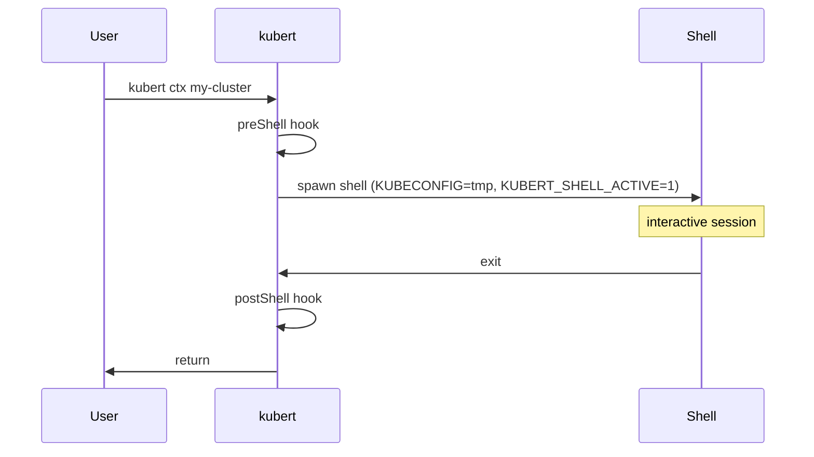
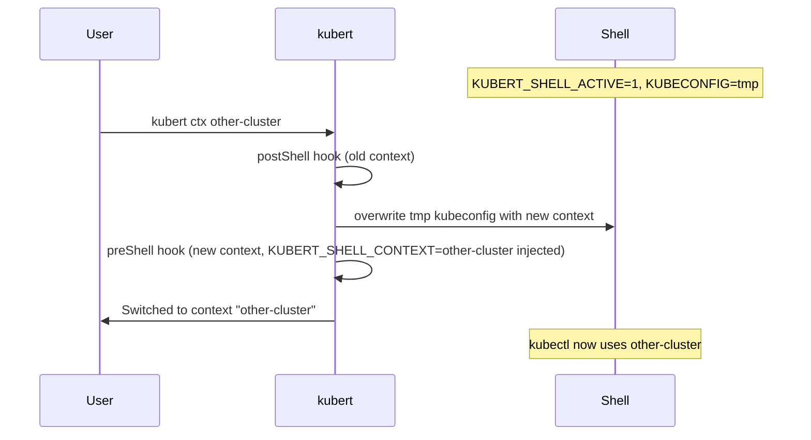

# Context switching modes

`kubert ctx` has two modes depending on whether it is invoked from inside an
existing kubert shell or from a plain terminal.

## Default mode — in-place switch

When `KUBERT_SHELL_ACTIVE=1` is set (i.e. you are already inside a kubert
shell), kubert rewrites the existing temporary kubeconfig in-place instead of
spawning a new shell. `KUBECONFIG` keeps pointing at the same path so kubectl
picks up the new context immediately, and `$SHLVL` never increases.

## Recursive mode

Pass `--recursive` (or set `recursive: true` in your config) to always spawn a
new sub-shell, even from inside an existing kubert shell. This replicates the
behaviour from before v0.8.0 and is useful if you deliberately want nested,
independently-isolated shells.

---

## Flow

---

## Hook firing order

### First invocation / recursive mode

### In-place switch (default, inside a kubert shell)

---

## Env vars set at shell spawn

| Variable                           | Value                      | Updated on in-place switch?        |
| ---------------------------------- | -------------------------- | ---------------------------------- |
| `KUBECONFIG`                       | path to temp kubeconfig    | yes — file is overwritten in-place |
| `KUBERT_SHELL_ACTIVE`              | `1`                        | n/a                                |
| `KUBERT_SHELL_KUBECONFIG`          | path to temp kubeconfig    | no — same file throughout          |
| `KUBERT_SHELL_CONTEXT`             | context name at spawn time | no — reflects spawn context only   |
| `KUBERT_SHELL_ORIGINAL_KUBECONFIG` | original kubeconfig path   | no                                 |
| `KUBERT_SHELL_STATE_FILE`          | path to state file         | no                                 |

> `KUBERT_SHELL_CONTEXT` is not updated after an in-place switch because a
> child process cannot modify its parent shell's environment. `KUBECONFIG`
> works correctly because kubert owns the file it points to and rewrites it
> directly. Shell prompt integrations should read from `KUBECONFIG` or the
> kubert state file rather than relying on `KUBERT_SHELL_CONTEXT`.
