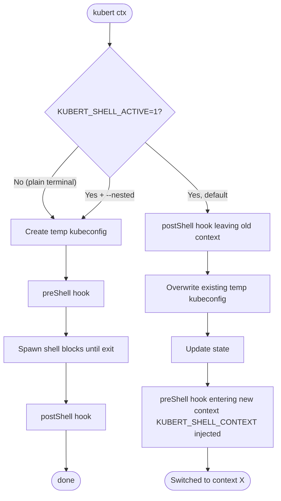
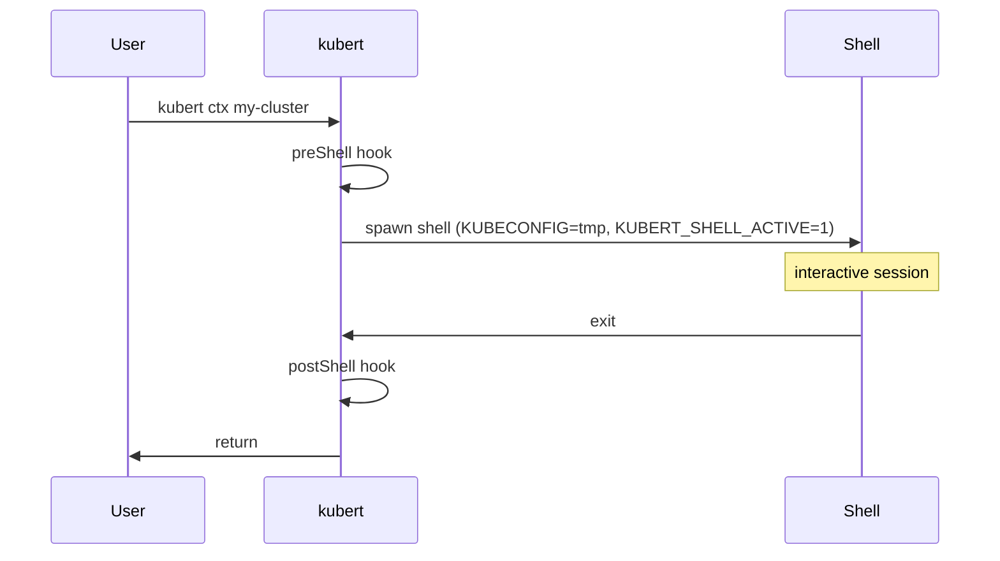
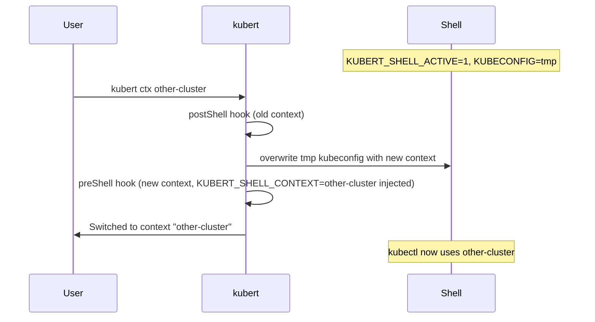

# Context switching modes

`kubert ctx` has two modes depending on config and whether it is invoked from inside an
existing kubert shell or from a plain terminal.

## Default mode — in-place switch

When `KUBERT_SHELL_ACTIVE=1` is set (i.e. you are already inside a kubert
shell, started with `kubert ctx`), kubert rewrites the existing temporary kubeconfig in-place instead of
spawning a new shell. `KUBECONFIG` keeps pointing at the same path so kubectl
picks up the new context immediately, and `$SHLVL` never increases.

## Nested mode

Pass `--nested` (or set `nested: true` in your config) to always spawn a
new sub-shell, even from inside an existing kubert shell. This replicates the
behaviour from before v0.8.0 and is useful if you deliberately want nested,
independently-isolated shells.

---

## Flow

---

## Hook firing order

### First invocation / nested mode

### In-place switch (default, inside a kubert shell)

---

## Env vars set at shell spawn

| Variable                           | Value                    | Set without shell-init?  | Updated on in-place switch?                 |
| ---------------------------------- | ------------------------ | ------------------------ | ------------------------------------------- |
| `KUBECONFIG`                       | path to temp kubeconfig  | yes                      | yes — file is overwritten in-place          |
| `KUBERT_SHELL_ACTIVE`              | `1`                      | yes                      | n/a                                         |
| `KUBERT_SHELL_KUBECONFIG`          | path to temp kubeconfig  | yes                      | no — same file throughout                   |
| `KUBERT_SHELL_CONTEXT`             | context name             | no — requires shell-init | yes — via env-update file (shell-init only) |
| `KUBERT_SHELL_ORIGINAL_KUBECONFIG` | original kubeconfig path | no — requires shell-init | no                                          |
| `KUBERT_SHELL_STATE_FILE`          | path to state file       | yes                      | no                                          |

### Why some vars require shell-init

A child process (kubert) cannot modify environment variables in its parent shell.
`KUBECONFIG` works because kubert owns the file it points to and rewrites the
content directly — the path stays the same.

`KUBERT_SHELL_CONTEXT` and `KUBERT_SHELL_ORIGINAL_KUBECONFIG` hold string values
that would need to change on every in-place switch, which is impossible from a
child process without cooperation from the shell itself.

**With `kubert shell-init`** the shell wraps the `kubert` binary in a function.
After each `kubert ctx` call the function sources a small env-update file
(`/tmp/kubert-env-<pid>`) that kubert wrote, making `KUBERT_SHELL_CONTEXT` stay
accurate across every in-place switch. Without shell-init these two vars are
never set to avoid stale values being worse than no value at all.

See [Shell Init](../README.md#shell-init-optional) in the README for setup instructions.
